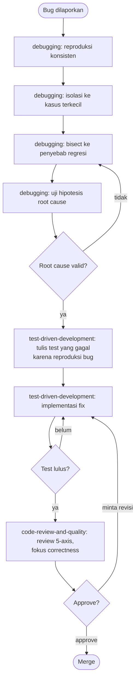
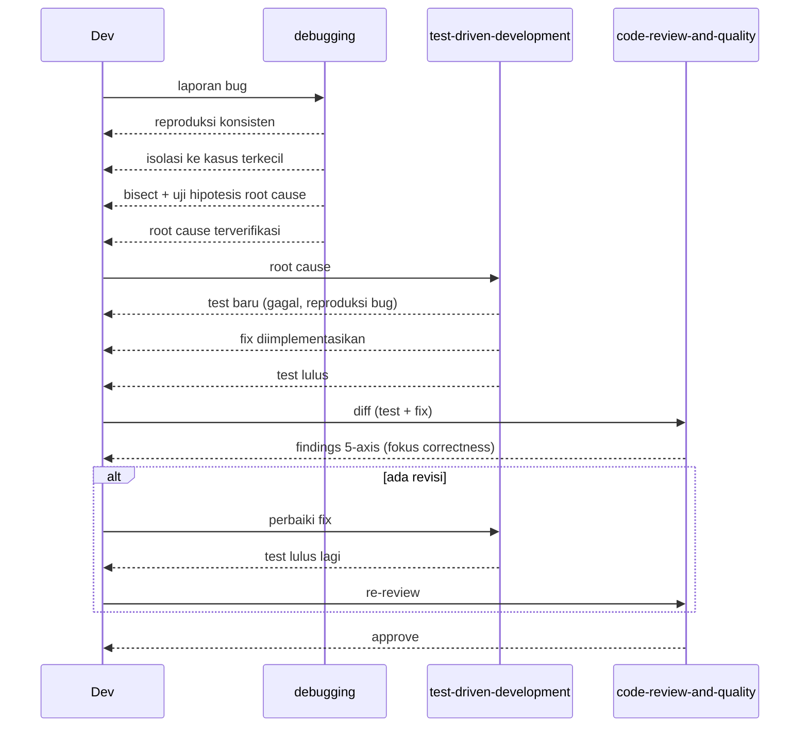

# Bug fix flow

Buat: ada bug yang perlu diperbaiki, dari laporan sampai fix yang di-review.

## Urutan

1. **`debugging`** — metodologi root-cause: reproduksi konsisten, isolasi ke
   kasus terkecil, bisect ke penyebab, uji hipotesis sebelum fix. Jangan
   langsung nulis fix sebelum root cause jelas.
2. **`test-driven-development`** — tulis test yang gagal karena bug ini
   dulu, baru fix sampai test-nya lulus. Test ini juga jadi regression guard.
3. **`code-review-and-quality`** — review sebelum merge, khususnya axis
   correctness — pastikan fix nggak cuma nutup gejala.

## Diagram

## Contoh

- Bug "harga di keranjang salah kalau ada diskon bertumpuk" →
  `debugging` (reproduksi kombinasi diskon yang bikin salah, isolasi ke
  fungsi hitung harga) → `test-driven-development` (test kasus diskon
  bertumpuk, fix sampai lulus) → `code-review-and-quality`.
