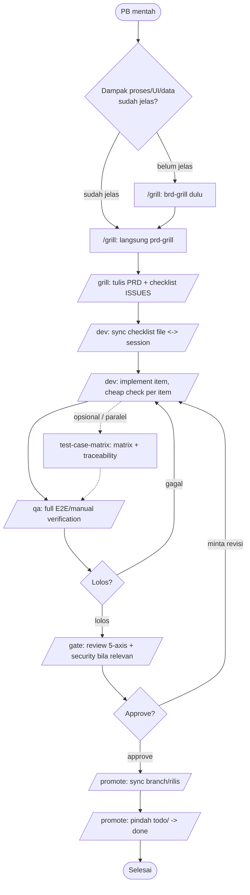
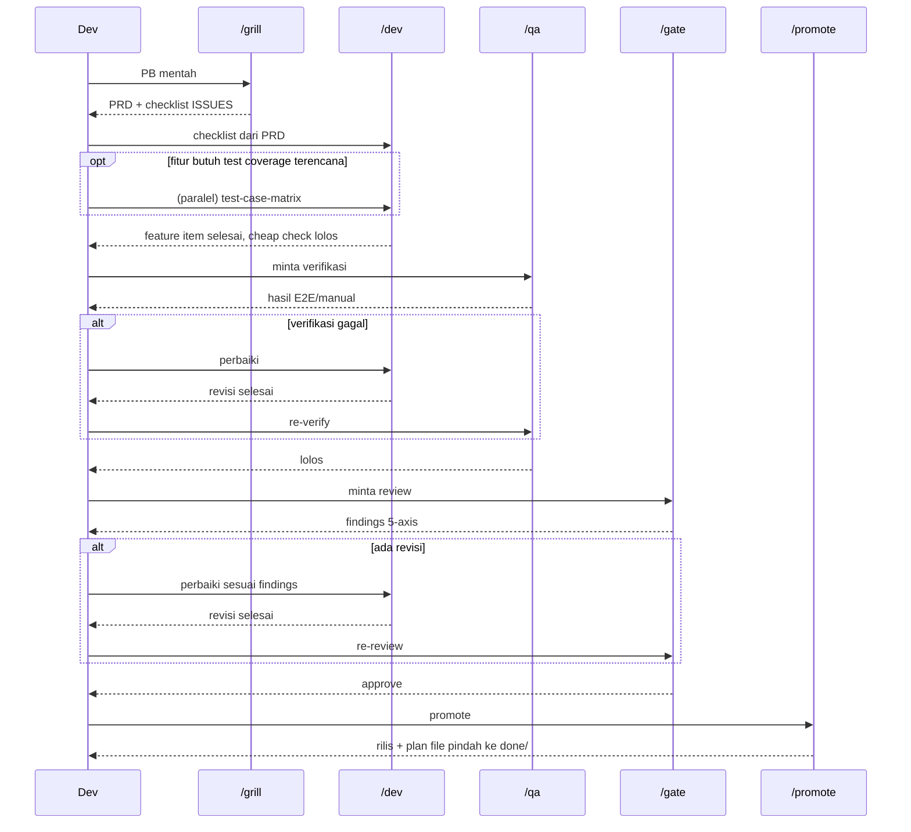

# New feature flow

Buat: fitur baru yang masih berupa ide mentah / Product Backlog item,
sampai jadi kode yang lolos verifikasi, review, dan ter-deploy.

Ini flow di balik pipeline 5 command di `.claude/commands/`: **`/grill` →
`/dev` → `/qa` → `/gate` → `/promote`**. Tiap command adalah wrapper tipis
di atas skill-skill di bawah — lihat isi commandnya kalau mau detail
step-by-step.

## Urutan

1. **`/grill`** (wraps `brd-grill` → `prd-grill`) — ubah PB jadi PRD +
   checklist ISSUES lewat tanya-jawab satu-pertanyaan-per-giliran.
   `brd-grill` cuma dipanggil kalau dampak proses/UI/kamus data belum
   jelas; skip kalau requirement sudah jelas.
2. **`/dev`** (wraps `exec-todo`) — eksekusi checklist ISSUES sebagai task
   list ter-tracking, implement satu item per satu, cheap check saja
   (unit test/type-check/build) per item. **Berhenti** begitu semua
   feature item selesai — tidak menjalankan test/review mahal.
3. **`/qa`** (wraps `e2e-testing`/`react-testing`/`webapp-testing`/
   `api-testing`) — full E2E/manual verification terhadap flow nyata yang
   disentuh fitur ini. Dipanggil eksplisit, bisa di-batch (`--run-pending`)
   kalau beberapa PB numpuk menunggu verifikasi.
4. **`/gate`** (wraps `code-review-and-quality` + `security-review` bila
   relevan, atau agent `reviewer`) — review 5-axis. Menolak jalan kalau
   `/qa` belum lolos. Revisi balik ke `/dev` kalau ada blocking finding.
5. **`/promote`** (wraps `branching`/`deployment`) — rilis: sync ke
   staging/production sesuai model branch repo, lalu pindahkan plan file
   dari `todo/` ke `done/`. Menolak jalan kalau `/qa`/`/gate` belum lolos.

**Opsional, sebelum/paralel `/dev`:** **`test-case-matrix`** — kalau fitur
butuh test coverage terencana (bukan cuma ditulis ad-hoc), tulis dulu
matrix-nya dari PRD sebelum implementasi jalan; `/qa` nanti eksekusi
terhadap matrix ini.

## Kenapa `/qa`/`/gate` dipisah dari `/dev`

Sebelumnya `exec-todo` menggabungkan implement + full test/review jadi satu
langkah, sehingga full testing ter-trigger otomatis tiap kali satu PB
selesai — boros waktu dan token untuk perubahan kecil. Sekarang `/dev`
cuma menjalankan cheap check; kamu yang memutuskan kapan bayar biaya
`/qa`+`/gate`, langsung atau di-batch lintas beberapa PB.

## Diagram

## Contoh

- PB "tambah export CSV di halaman laporan" → `/grill` (brd-grill dulu,
  karena belum jelas dampaknya ke data yang di-export) → `/dev` → `/qa` →
  `/gate` → `/promote`.
- Requirement sudah jelas dari stakeholder (skip BRD di dalam `/grill`) →
  `/grill` → `/dev` → `/qa` → `/gate` → `/promote`.
- Beberapa PB kecil numpuk selesai `/dev` di hari yang sama → `/qa
  --run-pending` lalu `/gate --run-pending` sekali untuk semuanya, bukan
  satu-satu.
