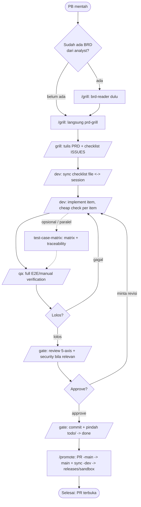
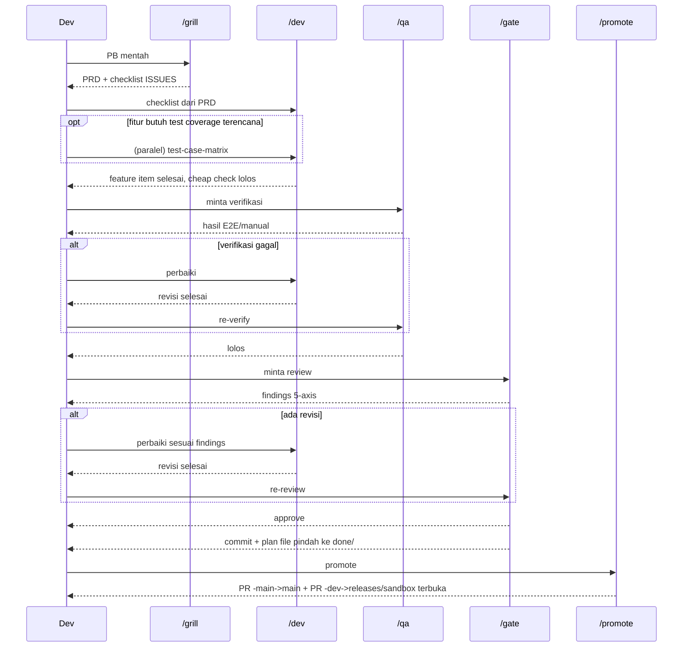

# New feature flow

Buat: fitur baru yang masih berupa ide mentah / Product Backlog item,
sampai jadi kode yang lolos verifikasi, review, dan PR-nya terbuka. Pipeline
ini berhenti di "PR terbuka" — tidak ada langkah deploy/CI di dalamnya.

Ini flow di balik pipeline 5 command di `.claude/commands/`: **`/grill` →
`/dev` → `/qa` → `/gate` → `/promote`**. Tiap command adalah wrapper tipis
di atas skill-skill di bawah — lihat isi commandnya kalau mau detail
step-by-step.

## Urutan

1. **`/grill`** (wraps `brd-reader` → `prd-grill`) — ubah PB jadi PRD +
   checklist ISSUES lewat tanya-jawab satu-pertanyaan-per-giliran.
   `brd-reader` cuma dipanggil kalau PB itu sudah punya BRD dari
   analyst (baca & pahami dulu); skip langsung ke `prd-grill` kalau belum
   ada BRD sama sekali. `brd-reader` tidak pernah menulis BRD baru.
2. **`/dev`** (wraps `exec-todo`) — eksekusi checklist ISSUES sebagai task
   list ter-tracking, implement satu item per satu, cheap check saja
   (unit test/type-check/build) per item. **Berhenti** begitu semua
   feature item selesai — tidak menjalankan test/review mahal.
3. **`/qa`** (wraps `e2e-testing`/`react-testing`/`webapp-testing`/
   `api-testing`) — full E2E/manual verification terhadap flow nyata yang
   disentuh fitur ini. Dipanggil eksplisit, bisa di-batch (`--run-pending`)
   kalau beberapa PB numpuk menunggu verifikasi.
4. **`/gate`** (wraps `code-review-and-quality` + `security-review` bila
   relevan, atau agent `reviewer`) — review 5-axis. Menolak jalan kalau
   `/qa` belum lolos. Revisi balik ke `/dev` kalau ada blocking finding.
   Begitu approve tanpa revisi: commit sisa perubahan, lalu pindahkan plan
   file dari `todo/` ke `done/` — plan dianggap "selesai" begitu terverifikasi
   dan direview, tidak menunggu langkah branch/rilis.
5. **`/promote`** (wraps `branching`) — murni buka PR: PR
   `<slug>-main` → `main`, plus (kalau repo pakai model paired-branch)
   `branching`'s `sync <slug>` (buat/update `-dev`, cherry-pick, PR
   `-dev` → branch staging) dijalankan dari sini juga, bukan command
   terpisah. Nama branch staging tidak fixed — repo bisa pakai
   `releases/sandbox` atau `releases/staging`; kalau keduanya ada di repo
   yang sama, `/promote` klarifikasi dulu ke user branch mana yang
   dimaksud, bukan nebak. Tidak ada cek CI/deploy sama sekali — job-nya
   selesai begitu PR-PR itu terbuka. Menolak jalan kalau `/qa`/`/gate`
   belum lolos.

**PB kecil (bukan fitur multi-file, bukan bug)?** Jangan paksakan lewat
`/grill` — `prd-grill` sendiri menolak "trivial one-line tasks" dan
command lain di pipeline ini (`/dev`/`/qa`/`/gate`/`/promote`) semuanya
butuh file plan untuk resolve argumennya. Pakai
[`small-change-flow.md`](small-change-flow.md) sebagai gantinya.

**Opsional, sebelum/paralel `/dev`:** **`test-case-matrix`** — kalau fitur
butuh test coverage terencana (bukan cuma ditulis ad-hoc), tulis dulu
matrix-nya dari PRD sebelum implementasi jalan; `/qa` nanti eksekusi
terhadap matrix ini.

## Kenapa `/qa`/`/gate` dipisah dari `/dev`

Sebelumnya `exec-todo` menggabungkan implement + full test/review jadi satu
langkah, sehingga full testing ter-trigger otomatis tiap kali satu PB
selesai — boros waktu dan token untuk perubahan kecil. Sekarang `/dev`
cuma menjalankan cheap check; kamu yang memutuskan kapan bayar biaya
`/qa`+`/gate`, langsung atau di-batch lintas beberapa PB.

## Diagram

## Contoh

- PB "tambah export CSV di halaman laporan" sudah punya BRD dari analyst →
  `/grill` (brd-reader baca BRD-nya dulu) → `/dev` → `/qa` → `/gate` →
  `/promote`.
- Belum ada BRD sama sekali (skip brd-reader di dalam `/grill`) →
  `/grill` → `/dev` → `/qa` → `/gate` → `/promote`.
- Beberapa PB kecil numpuk selesai `/dev` di hari yang sama → `/qa
  --run-pending` lalu `/gate --run-pending` sekali untuk semuanya, bukan
  satu-satu.
