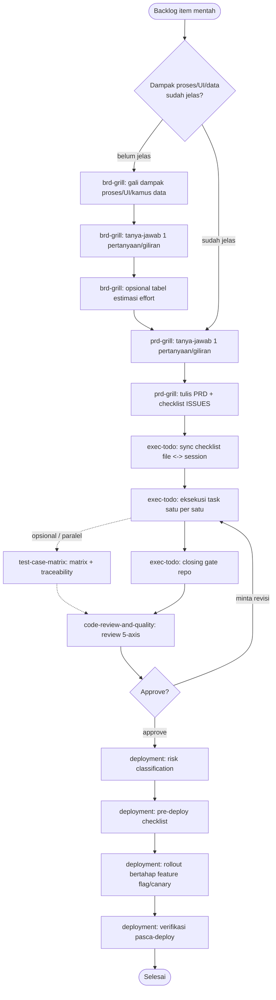
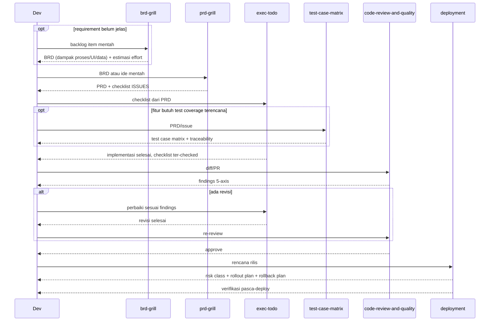

# New feature flow

Buat: fitur baru yang masih berupa ide mentah / item backlog, sampai jadi
kode yang di-review dan siap deploy.

## Urutan

1. **`brd-grill`** — kalau titik mulainya backlog item mentah dan butuh
   dampak proses/UI/kamus data digali dulu. Skip kalau kamu udah punya BRD
   atau requirement udah jelas.
2. **`prd-grill`** — ubah BRD (atau ide mentah langsung) jadi PRD + checklist
   eksekusi lewat tanya-jawab satu-pertanyaan-per-giliran.
3. **`exec-todo`** — eksekusi checklist dari `prd-grill` sebagai task list
   ter-tracking, sinkron checkbox file ↔ session.
4. **`test-case-matrix`** (opsional, sebelum/parallel implementasi) — kalau
   fitur butuh test coverage terencana, bukan cuma ditulis ad-hoc.
5. **`code-review-and-quality`** — review lima-axis sebelum merge. Bisa
   dipanggil manual atau lewat agent `reviewer`.
6. **`deployment`** — checklist rilis aman: risk classification, rollout
   bertahap, rollback plan.

## Diagram

## Contoh

- Backlog item "tambah export CSV di halaman laporan" → `brd-grill` (karena
  belum jelas dampaknya ke data yang di-export) → `prd-grill` → `exec-todo`
  → `code-review-and-quality` → `deployment`.
- Requirement udah jelas dari stakeholder (skip BRD) → langsung `prd-grill`
  → `exec-todo` → `code-review-and-quality`.
