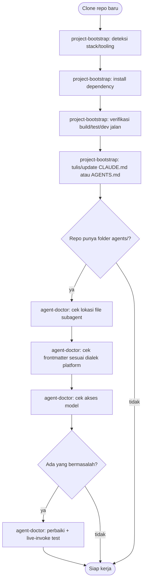
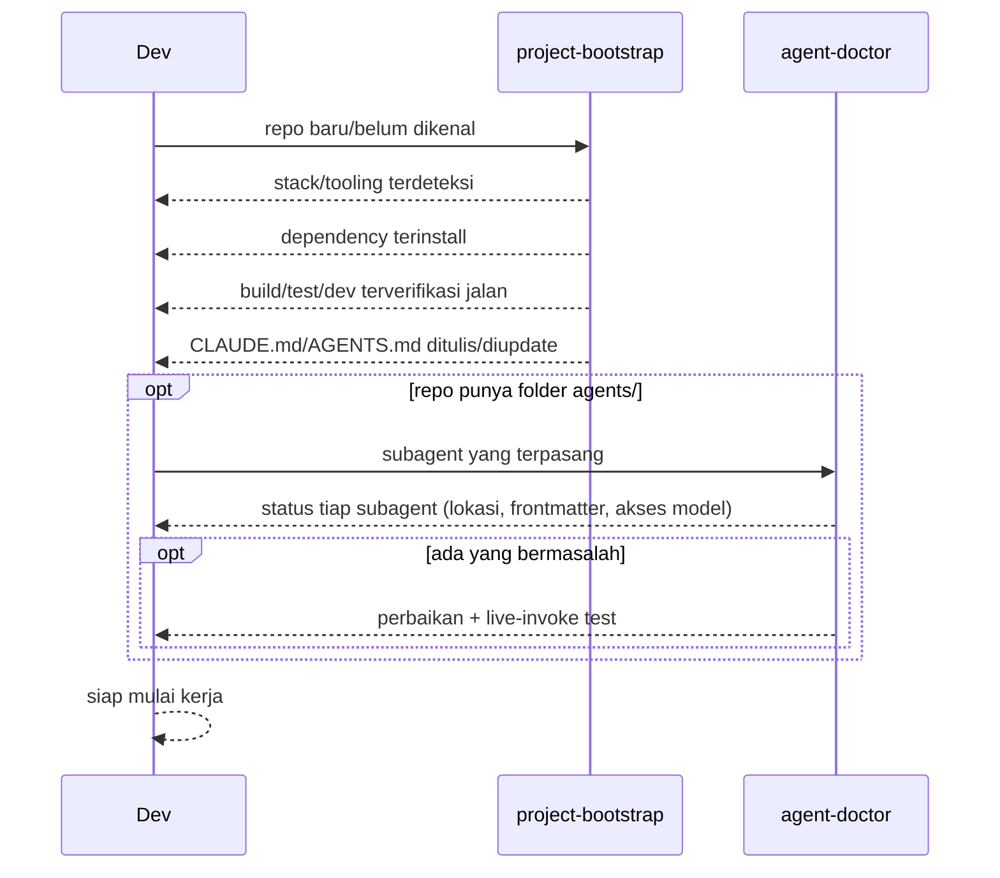

# New repo onboarding flow

Buat: sesi pertama kali kerja di repo/project yang belum dikenal agent.
Jalankan sekali di awal, bukan ritual tiap sesi.

## Urutan

1. **`project-bootstrap`** — deteksi stack/tooling, install dependency,
   verifikasi project benar-benar jalan (build/test/dev), lalu tulis/update
   `CLAUDE.md`/`AGENTS.md` dengan command yang sudah diverifikasi.
2. **`agent-doctor`** — kalau repo ini juga punya subagent terpasang
   (`agents/`), verifikasi subagent-nya beneran bisa jalan di platform
   kamu saat ini (lokasi file, frontmatter, akses model).

## Diagram

## Contoh

- Clone repo baru, belum ada `CLAUDE.md` → `project-bootstrap` dulu supaya
  command build/test yang ditulis di `CLAUDE.md` udah terverifikasi jalan,
  bukan ditebak dari `package.json` doang.
