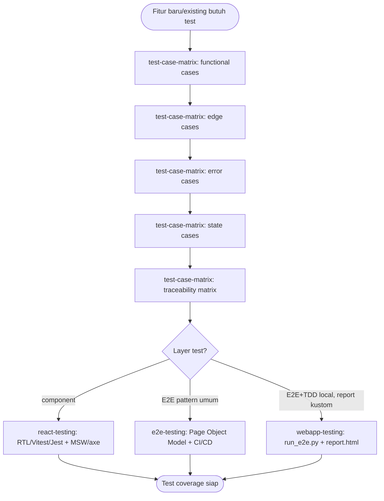
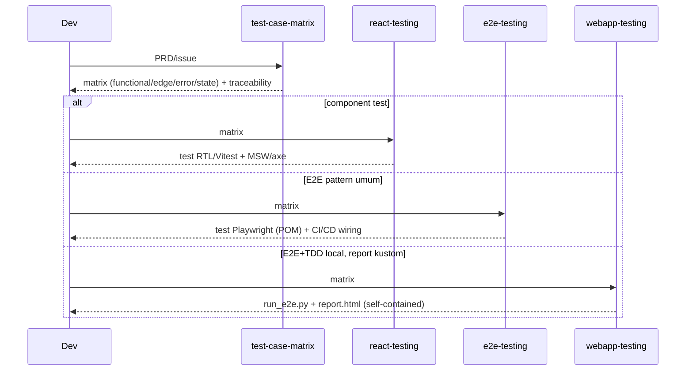

# QA flow

Buat: nambah test coverage buat fitur (baru atau existing). Setara sama
apa yang dilakukan agent `qa-engineer` — pakai flow ini kalau kerja tanpa
subagent atau mau kontrol tiap langkahnya manual.

## Urutan

1. **`test-case-matrix`** — selalu mulai dari sini. Tulis matrix test case
   (functional/edge/error/state) dari PRD/issue jadi checklist markdown +
   traceability matrix, sebelum test code ditulis.
2. Pilih skill implementasi sesuai layer:
   - **`react-testing`** — component test (RTL, Vitest/Jest, MSW, axe).
   - **`e2e-testing`** — pola Playwright E2E umum (Page Object Model, CI/CD).
   - **`webapp-testing`** — kalau butuh workflow E2E+TDD siap-eksekusi
     local-only dengan report kustom (`run_e2e.py` + `report.html`),
     bukan cuma pola Playwright.

## Diagram

## Contoh

- Fitur checkout baru → `test-case-matrix` (list semua skenario: bayar
  sukses, kartu ditolak, keranjang kosong, dst) → `webapp-testing` buat
  eksekusi E2E-nya local dengan report yang bisa di-review.
