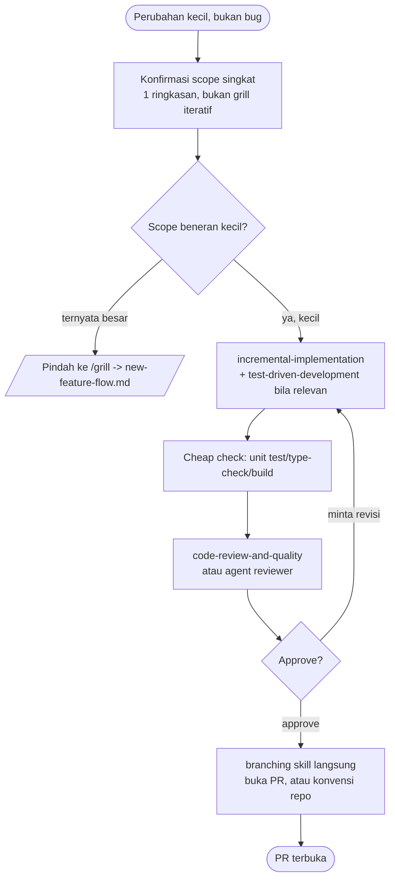

# Small change flow

Buat: perubahan yang genuinely kecil dan **bukan bug** (itu
[`bug-fix-flow.md`](bug-fix-flow.md)) — misalnya nambah satu null-check,
ganti label, nambah satu field di form yang sudah ada, atau task lain yang
tidak butuh dokumen rencana formal. Kalau kamu ragu apakah suatu PB masuk
sini atau ke pipeline penuh `new-feature-flow.md`, defaultnya: **kalau
scope-nya bisa dijelaskan dalam satu-dua kalimat dan cuma nyentuh 1-2
file, ini jalurnya.** Kalau ragu, tanya user, jangan nebak.

Ini sengaja **di luar** pipeline 5-command (`/grill`→`/dev`→`/qa`→`/gate`→
`/promote`) — semua command itu (`/dev`, `/qa`, `/gate`, `/promote`) butuh
file plan (`docs/prd/todo/<slug>/ISSUES.md` atau setara) untuk resolve
argumennya, dan `prd-grill` sendiri sudah bilang bukan untuknya "trivial
one-line tasks that don't need a written plan". Memaksa PB kecil lewat
`/grill` cuma bikin dokumen plan formal untuk perubahan yang tidak
butuh itu.

## Urutan

1. **Konfirmasi scope singkat** — bukan grill iteratif satu-pertanyaan-
   per-giliran seperti `prd-grill`, cukup satu ringkasan: apa yang
   berubah, file mana, dan apa yang eksplisit di luar scope. Minta user
   konfirmasi sebelum menyentuh kode. Kalau ternyata pas dikonfirmasi
   scope-nya lebih besar dari perkiraan (nyentuh >2 file, butuh keputusan
   desain, atau butuh endpoint/schema baru), **berhenti** dan arahkan ke
   `/grill` — jangan lanjut memperbesar scope diam-diam di jalur ringan
   ini.
2. **Implementasi** — pakai
   [`incremental-implementation`](../skills/incremental-implementation/SKILL.md)
   kalau ternyata nyentuh lebih dari satu file, dan
   [`test-driven-development`](../skills/test-driven-development/SKILL.md)
   kalau ini mengubah behavior. Cheap check (unit test/type-check/build)
   sebelum lanjut — sama disiplinnya dengan `/dev`, cuma tanpa bookkeeping
   checklist file karena tidak ada plan file untuk disinkronkan.
3. **Review** — panggil skill
   [`code-review-and-quality`](../skills/code-review-and-quality/SKILL.md)
   langsung (atau agent `reviewer`, kalau repo ini punya), bukan `/gate`
   — `/gate` butuh plan file untuk resolve argumennya dan tidak akan
   berlaku di sini. Tambahkan
   [`security-review`](../skills/security-review/SKILL.md) kalau
   perubahan ini menyentuh auth/data/secret.
4. **Buka PR** — kalau repo ini pakai model paired-branch (lihat
   [`branching`](../skills/branching/SKILL.md) Step 0), pakai skill itu
   langsung untuk buka PR-nya; kalau tidak, ikuti konvensi PR biasa repo
   ini. Tidak perlu `/promote` — command itu juga butuh plan file untuk
   resolve argumennya.

## Kapan **tidak** boleh pakai jalur ini

- Kalau ini bug (root cause belum jelas) — pakai
  [`bug-fix-flow.md`](bug-fix-flow.md), bukan ini.
- Kalau scope-nya, setelah dikonfirmasi di Step 1, ternyata menyentuh
  lebih dari 1-2 file, butuh keputusan desain, atau ada endpoint/schema
  baru — pindah ke `new-feature-flow.md` (mulai dari `/grill`), jangan
  dipaksakan lewat jalur ringan ini.
- Kalau repo ini punya "definition of done" tertulis (mis. di CLAUDE.md)
  yang mewajibkan full E2E/manual verification untuk *semua* perubahan
  tanpa terkecuali — ikuti itu, jalur ini tidak mengesampingkan aturan
  repo yang eksplisit.

## Diagram

## Contoh

- "Tambah null-check di fungsi hitung diskon supaya nggak crash kalau
  kupon kosong" → konfirmasi scope (1 file, 1 fungsi) → fix + unit test →
  `code-review-and-quality` → buka PR langsung, tanpa `/grill`.
